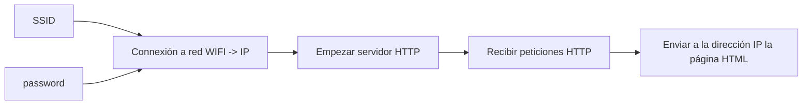
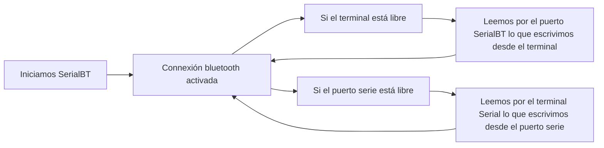
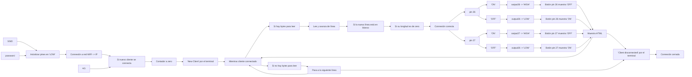
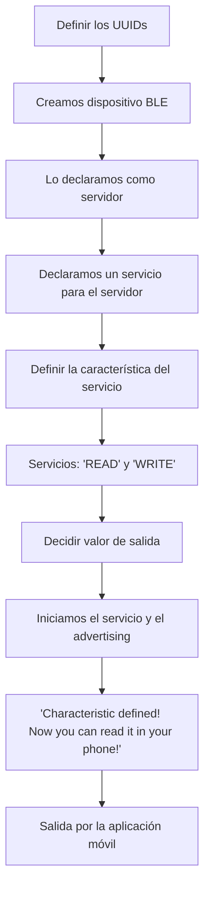

# Procesadores Digitales - Práctica 4

## Objetivo
<div align="justify">
El objetivo de esta práctica consiste en comprender el funcionamiento de WIFI y bluetooth. Para ello generaremos una web utlizando el procesador esp32, usando lenguaje html. También estableceremos una comunicación serie con una aplicacion de móvil pudiendo mantener una conversación a través de esta aplicación. Además, implementaremos un código que permite encender y apagar unos leds mediante connexión bluetooth generando una página con dirección IP.

## Generación de una página web

En primer lugar, para realizar una correcta connexión, deberemos incluir la libreria de `<WIFI.h>` que nos servirá para connectarnos sin problemas a la red wifi; y la de `<WebServer.h>` que nos proporcionará métodos de configuración del servidor y no tener problemas la implementación de la connexión, además de la de `<Arduino.h>`.

```cpp
#include <Arduino.h>
#include <WiFi.h>
#include <WebServer.h>
```

Después de eso, debemos incluir la red wifi en la cual queremos trabajar. Para ello, creamos dos cadenas de carácteres, una para el nombre de la red (SSID: Service Set Identifier) y otra para la contraseña. 

```cpp
const char* ssid = "*********"
const char* password = "**********"
```

A continuación, creamos un objeto de WebServer para poder acceder a las funciones de la librería en cuestión. Utilizamos como parámetro de entrada el puerto en el que va a escuchar el servidor al que estemos conectados. El valor por defecto es de 80 ya que es el puerto que usa HTTP, por lo que esto permite connectarnos al servidor sin tener que especificar el puerto en la URL.

```cpp
WebServer server(80);
```

Como último paso antes de empezar el `setup()`, declaramos la variable que almacenará el contenido de nuestra página web en lenguaje html. Ésta será un `string`.

```cpp
String HTML = "<!DOCTYPE html>\
  <html>\
  <body>\
  <h1>My Primera Pagina con ESP32 - Station Mode &#128522;</h1>\
  </body>\
  </html>";
```

Una vez eso hecho, nuestro programa intentará establecer connexión en la red wifi con la función `WIFI.begin(ssid,password)`, con los valores de nuestra red como parámetros de entrada. Justo después, se detendrá en un bucle hasta que no se connecte, comprobando cada 1 segundo si la connexión ha sido exitosa o no con `WL_CONNECTED`. 

```cpp
WiFi.begin(ssid, password);
while (WiFi.status() != WL_CONNECTED) {
  delay(1000);
  Serial.print(".");
}
```

En cuanto se haya connectado, nos avisará por el terminal que se habrá establecido connexión exitosa e imprimirá la IP del servidor web generado con `Serial.println(WiFi.localIP())`. El siguiente paso es determinar qué código debe ejecutarse cuando se accede a una URL específica. Con `server.on("/", handle_root)`, indicamos que cuando un servidor recibe una solicitud HTTP en la URL `('/')`, llamará a la función `handle_root`. Con esa condición declarada, ya podemos inicializar el web server con `server.begin()` y lo hacemos saber al usuario por el terminal. 

```cpp
Serial.println("WiFi connected successfully");
Serial.print("Got IP: ");
Serial.println(WiFi.localIP()); 
server.on("/", handle_root);
server.begin();
Serial.println("HTTP server started");
```

Si nos centramos en la función `handle_root()` que llamamos en el `setup()`, consiste en enviar el código `200` de estado HTTP, que se corresponde con respuesta `OK`, especificamos el tipo en `"text/html"` y finalmente le pasamos la variable con el contenido deseado (fichero html).

```cpp
void handle_root() {
  server.send(200, "text/html", HTML);
}
```

Para finalizar, dentro del `loop()` tan solo recibimos las peticiones del usuario de direcciones HTTP.

```cpp
void loop() {
  server.handleClient();
}
```

Por lo que juntándolo todo, queda el siguiente código:

```cpp
#include <Arduino.h>
#include <WiFi.h>
#include <WebServer.h>

// SSID & Password
const char* ssid = "XARTIC369";
const char* password = "**********";

WebServer server(80);
void handle_root();

String HTML = "<!DOCTYPE html>\
  <html>\
  <body>\
  <h1>My Primera Pagina con ESP32 - Station Mode &#128522;</h1>\
  </body>\
  </html>";

void setup() {
  Serial.begin(115200);
  Serial.println("Try Connecting to ");
  Serial.println(ssid);
  
  WiFi.begin(ssid, password);
  
  while (WiFi.status() != WL_CONNECTED) {
    delay(1000);
    Serial.print(".");
  }
  Serial.println("");
  Serial.println("WiFi connected successfully");
  Serial.print("Got IP: ");
  Serial.println(WiFi.localIP()); 
  server.on("/", handle_root);
  server.begin();
  Serial.println("HTTP server started");
  delay(100);
}

void loop() {
  server.handleClient();
}

void handle_root() {
  server.send(200, "text/html", HTML);
}
```

Con una salida:

```cpp
Try Connecting to 'XARTIC369'
.......
WiFi connected successfully
Got IP: 192.168.0.105
HTTP server started
```
Y la visualización de la página web:


Para ver el fichero html creado, tan solo hay que cambiar el contenido de la variable de HTML en el trozo de código en el que hemos escrito la página web de prueba. Es decir, sustituimos por `String HTML = "fitxer_html.MD.html"` esa línea de código. Y la visualización del fichero HTML generado es la siguiente:


### Diagrama de flujo


## Comunicación mediante Bluetooth Classic

Para esta aplicación, incluimos la libreria `BluetoothSerial.h`. Las tres líneas siguientes sirven para comprobar que las configuraciones de Bluetooth están habilitadas en el Software Development Kit (SDK), es decir, en un conjunto de herramientas software que sirven para crear aplicaciones mediante un compilador, un depurador (debugger) o un framework, si no es así, entonces hay que recompilarlo.

```cpp
#include <Arduino.h>
#include "BluetoothSerial.h"
#if !defined(CONFIG_BT_ENABLED) || !defined(CONFIG_BLUEDROID_ENABLED)
#error Bluetooth is not enabled! Please run `make menuconfig` to and enable it
#endif
```

Ahora, iniciamos una instancia de esta misma librería, llamándola `SerialBT`.

```cpp
BluetoothSerial SerialBT;
```

Y ya podemos empezar el `setup()`. Abrimos el puerto serie a `115200`, comenzamos con la función `.begin()`, iniciando el servicio BT con el nombre `ESP32test` y anunciamos por el terminal que la connexión está preparada para ser establecida.

```cpp
void setup() {
  Serial.begin(115200);
  SerialBT.begin("ESP32test"); //Bluetooth device name
  Serial.println("The device started, now you can pair it with bluetooth!");
}
```

Dentro del bucle, simplemente recibimos lo que nos entra por el puerto SerialBT a la consola y viceversa. Es decir, copiamos lo que llega de SerialBT y enviamos al puerto lo que escrivimos desde la consola con la condición que los puertos estén libres.

```cpp
void loop() {
  if (Serial.available()) {
  SerialBT.write(Serial.read());
  }
  if (SerialBT.available()) {
  Serial.write(SerialBT.read());
  }
  delay(20);
}
```
Para que funcione correctamente, tenemos que descargar la aplicación Serial Bluetooth Terminal y configurarla de modo que el puerto serie esté connectado con nuestro microprocesador ESP32. Así pues, desde la aplicación del móvil se ve de la siguiente forma:

<image src='images/bluetooth.jpg' alt='image' width='450'>

Y la salida por el terminal es:
```cpp
The device started, now you can pair it with bluetooth!

ahora podemos comunicarnos desde un móvil a un terminal del ordenador
```
### Diagrama de flujo



## Encedido y apagado de LEDS

Para esta aplicación, incluimos la librería `WIFI.h`. Igual que en las dos primeras, incluimos una red WIFI donde se creará la web en la dirección IP y un objeto `WIFIServer` con el valor 80 por defecto. Para guardar la dirección HTTP, creamos un `String` llamado `header` además de dos variables auxiliares (`output26State` y `output27State`) también cadenas de caractéres para almacenar las salidas de los dos pines destinados a los LEDs (`output26 = 26` y `output27 = 27`). Antes del `setup()`, declaramos las variables de tiempo que nos servirán para poner las condiciones de encendido y apagado.

````cpp
#include <Arduino.h>
#include <WiFi.h>

const char* ssid = "XARTIC369";
const char* password = "xarticcr369";

WiFiServer server(80);

// Variable to store the HTTP request
String header;

// Auxiliar variables to store the current output state
String output26State = "off";
String output27State = "off";

// Assign output variables to GPIO pins
const int output26 = 26;
const int output27 = 27;

// Current time
unsigned long currentTime = millis();
// Previous time
unsigned long previousTime = 0; 
// Define timeout time in milliseconds (example: 2000ms = 2s)
const long timeoutTime = 2000;
````

Dentro del `setup()` iniciamos con una velocidad de `115200`, asignamos los pines como `outputs`, los inicializamos a nivel `LOW` y nos connectamos a la red WIFI como en los casos anteriores, mostrando por el terminal la dirección IP de la red en concreto.

````cpp
void setup() {
  Serial.begin(115200);
  // Initialize the output variables as outputs
  pinMode(output26, OUTPUT);
  pinMode(output27, OUTPUT);
  // Set outputs to LOW
  digitalWrite(output26, LOW);
  digitalWrite(output27, LOW);

  // Connect to Wi-Fi network with SSID and password
  Serial.print("Connecting to ");
  Serial.println(ssid);
  WiFi.begin(ssid, password);
  while (WiFi.status() != WL_CONNECTED) {
    delay(500);
    Serial.print(".");
  }
  // Print local IP address and start web server
  Serial.println("");
  Serial.println("WiFi connected.");
  Serial.println("IP address: ");
  Serial.println(WiFi.localIP());
  server.begin();
}
````

Es dentro del `loop()` que creamos un objeto del tipo cliente y nos avisa si el servidor está libre o tiene una petición. Si un nuevo cliente se connecta, ponemos los contadores de tiempo y muestra por el puerto serie el mensaje `New Client.`. Así, creamos un string que contendrá los datos que envíe el cliente y entramos dentro de un bucle mientras el cliente esté connectado. Si tiene bytes que leer, lo hace. En el caso que no sea así, simplemente añade el byte al final de la fila ya existente. Aunque si ese byte es una línea nueva, significa que la petición de HTTP ha terminado por lo que envía al cliente que la connexión es correcta. Justo después, establece los estados que pueden tomar los dos LEDs con los niveles `LOW` y `HIGH`. Una vez hecho eso, visualiza la página web HTML y pone el botón de los pines a `ON/OFF` teniendo en cuenta que debe mostrarse el nivel opuesto, es decir, si el pin 27 está en `OFF`, el botón debe mostrarse a `ON` para poder encenderlo. La respuesta HTTP termina con otra línea en blanco. En cuanto salimos del bucle, eliminamos el valor de `header` y cerramos la connexión avisando por el terminal.

```cpp
void loop(){
  WiFiClient client = server.available();   // Listen for incoming clients

  if (client) {                             // If a new client connects,
    currentTime = millis();
    previousTime = currentTime;
    Serial.println("New Client.");          // print a message out in the serial port
    String currentLine = "";                // make a String to hold incoming data from the client
    while (client.connected() && currentTime - previousTime <= timeoutTime) {  // loop while the client's connected
      currentTime = millis();
      if (client.available()) {             // if there's bytes to read from the client,
        char c = client.read();             // read a byte, then
        Serial.write(c);                    // print it out the serial monitor
        header += c;
        if (c == '\n') {                    // if the byte is a newline character
          // if the current line is blank, you got two newline characters in a row.
          // that's the end of the client HTTP request, so send a response:
          if (currentLine.length() == 0) {
            // HTTP headers always start with a response code (e.g. HTTP/1.1 200 OK)
            // and a content-type so the client knows what's coming, then a blank line:
            client.println("HTTP/1.1 200 OK");
            client.println("Content-type:text/html");
            client.println("Connection: close");
            client.println();
            
            // turns the GPIOs on and off
            if (header.indexOf("GET /26/on") >= 0) {
              Serial.println("GPIO 26 on");
              output26State = "on";
              digitalWrite(output26, HIGH);
            } else if (header.indexOf("GET /26/off") >= 0) {
              Serial.println("GPIO 26 off");
              output26State = "off";
              digitalWrite(output26, LOW);
            } else if (header.indexOf("GET /27/on") >= 0) {
              Serial.println("GPIO 27 on");
              output27State = "on";
              digitalWrite(output27, HIGH);
            } else if (header.indexOf("GET /27/off") >= 0) {
              Serial.println("GPIO 27 off");
              output27State = "off";
              digitalWrite(output27, LOW);
            }
            
            // Display the HTML web page
            client.println("<!DOCTYPE html><html>");
            client.println("<head><meta name=\"viewport\" content=\"width=device-width, initial-scale=1\">");
            client.println("<link rel=\"icon\" href=\"data:,\">");
            // CSS to style the on/off buttons 
            // Feel free to change the background-color and font-size attributes to fit your preferences
            client.println("<style>html { font-family: Helvetica; display: inline-block; margin: 0px auto; text-align: center;}");
            client.println(".button { background-color: #4CAF50; border: none; color: white; padding: 16px 40px;");
            client.println("text-decoration: none; font-size: 30px; margin: 2px; cursor: pointer;}");
            client.println(".button2 {background-color: #555555;}</style></head>");
            
            // Web Page Heading
            client.println("<body><h1>ESP32 Web Server</h1>");
            
            // Display current state, and ON/OFF buttons for GPIO 26  
            client.println("<p>GPIO 26 - State " + output26State + "</p>");
            // If the output26State is off, it displays the ON button       
            if (output26State=="off") {
              client.println("<p><a href=\"/26/on\"><button class=\"button\">ON</button></a></p>");
            } else {
              client.println("<p><a href=\"/26/off\"><button class=\"button button2\">OFF</button></a></p>");
            } 
               
            // Display current state, and ON/OFF buttons for GPIO 27  
            client.println("<p>GPIO 27 - State " + output27State + "</p>");
            // If the output27State is off, it displays the ON button       
            if (output27State=="off") {
              client.println("<p><a href=\"/27/on\"><button class=\"button\">ON</button></a></p>");
            } else {
              client.println("<p><a href=\"/27/off\"><button class=\"button button2\">OFF</button></a></p>");
            }
            client.println("</body></html>");
            
            // The HTTP response ends with another blank line
            client.println();
            // Break out of the while loop
            break;
          } else { // if you got a newline, then clear currentLine
            currentLine = "";
          }
        } else if (c != '\r') {  // if you got anything else but a carriage return character,
          currentLine += c;      // add it to the end of the currentLine
        }
      }
    }
    // Clear the header variable
    header = "";
    // Close the connection
    client.stop();
    Serial.println("Client disconnected.");
    Serial.println("");
  }
}
```
Implementado este código, la página web creada en la dirección IP es la siguiente:


### Diagrama de flujo



## Bluetooth Low Energy (BLE)

El bluetooth low energy es una variante del bluetooth clásico que se centra en economizar la energía. En este caso, BLE está en modo ahorro constantemente menos cuando la connexión se establece, a diferencia del bluetooth clásico que está siempre activo. Nuestro microprocesador ESP32 puede actuar como un servidor o como un cliente, nosotros lo utilizaremos como un servidor. Para hacerlo implementamos el siguiente código:

```cpp
#include <Arduino.h>
#include <BLEDevice.h>
#include <BLEUtils.h>
#include <BLEServer.h>

#define SERVICE_UUID        "4fafc201-1fb5-459e-8fcc-c5c9c331914b"
#define CHARACTERISTIC_UUID "beb5483e-36e1-4688-b7f5-ea07361b26a8"

void setup() {
  Serial.begin(115200);
  Serial.println("Starting BLE work!");

  BLEDevice::init("myESP32");
  BLEServer *pServer = BLEDevice::createServer();
  BLEService *pService = pServer->createService(SERVICE_UUID);
  BLECharacteristic *pCharacteristic = pService->createCharacteristic(CHARACTERISTIC_UUID,
                                                                      BLECharacteristic::PROPERTY_READ |
                                                                      BLECharacteristic::PROPERTY_WRITE
                                                                      );

  pCharacteristic->setValue("ona desde la tierra"); //0x6f6e61206465736465206c6120746965727261
  pService->start();
  // BLEAdvertising *pAdvertising = pServer->getAdvertising();  // this still is working for backward compatibility
  BLEAdvertising *pAdvertising = BLEDevice::getAdvertising();
  pAdvertising->start();
  Serial.println("Characteristic defined! Now you can read it in your phone!");
}

void loop() {
  // put your main code here, to run repeatedly:
  delay(2000);
}
```

Incluimos en el código las tres librerías de BLE que necesitaremos para poder llevar a cabo la connexión.

```cpp
#include <BLEDevice.h>
#include <BLEUtils.h>
#include <BLEServer.h
```

A continuación definimos los UUIDs (Universally Unique Identifier), uno para el servicio y otro para la característica. Estos son unos números únicos de 128-bit que se usan para designar a las diversas partes de los perfiles definidos por GATT (Generic Attributes). GATT es una estructura de datos que define la forma como dos dispositivos BLE envían y reciben mensajes. Es una estructura jerárquica en la que tenemos diferentes perfiles, compuestos por, normalmente, más de un servicio y éstos tienen una característica como mínimo. Estos códigos UUID se pueden generar, pero nosotros tan solo usamos los que venían por defecto.

```cpp
#define SERVICE_UUID        "4fafc201-1fb5-459e-8fcc-c5c9c331914b"
#define CHARACTERISTIC_UUID "beb5483e-36e1-4688-b7f5-ea07361b26a8"
```

Empezamos la comunicación a velocidad de `115200`, avisamos por el terminal que estamos estableciendo una connexión BLE y creamos un dispositivo con `BLEDevice::init("myESP32");`. Justo después, declaramos el dispositivo como servidor, un servicio para este servidor con el UUID declarado anteriormente y definimos la característica para ese servicio. En este caso, los servicios que porporcionará será el de `READ` y el de `WRITE`.

```cpp
BLEServer *pServer = BLEDevice::createServer();
BLEService *pService = pServer->createService(SERVICE_UUID);
BLECharacteristic *pCharacteristic = pService->createCharacteristic(CHARACTERISTIC_UUID,
                                                                    BLECharacteristic::PROPERTY_READ |
                                                                    BLECharacteristic::PROPERTY_WRITE
                                                                    );
```

Seguidamente, ya podemos poner el valor que queramos con el `setValue()`.

```cpp
pCharacteristic->setValue("ona desde la tierra"); //0x6f6e61206465736465206c6120746965727261
```

Finalmente iniciamos el servicio y el advertising, de modo que otros dispositvos sean capaces de escanear y encontrar este dispositivo BLE.

```cpp
pService->start();
BLEAdvertising *pAdvertising = BLEDevice::getAdvertising();
pAdvertising->start();
Serial.println("Characteristic defined! Now you can read it in your phone!");
```

Habiendo ejecutado lo anterior, desde el dispositivo móvil se ve de la siguiente forma, una vez establecida la connexión BLE:

<image src='images/BLE.jpg' alt='imageBLE' width='300'>

### Diagrama de flujo

